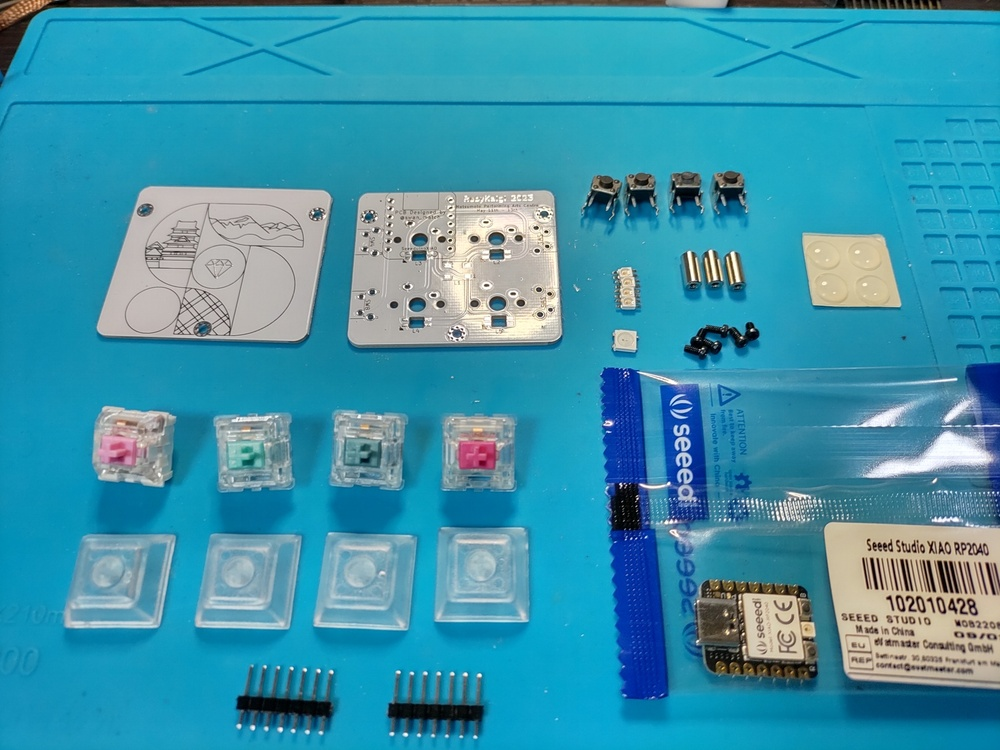
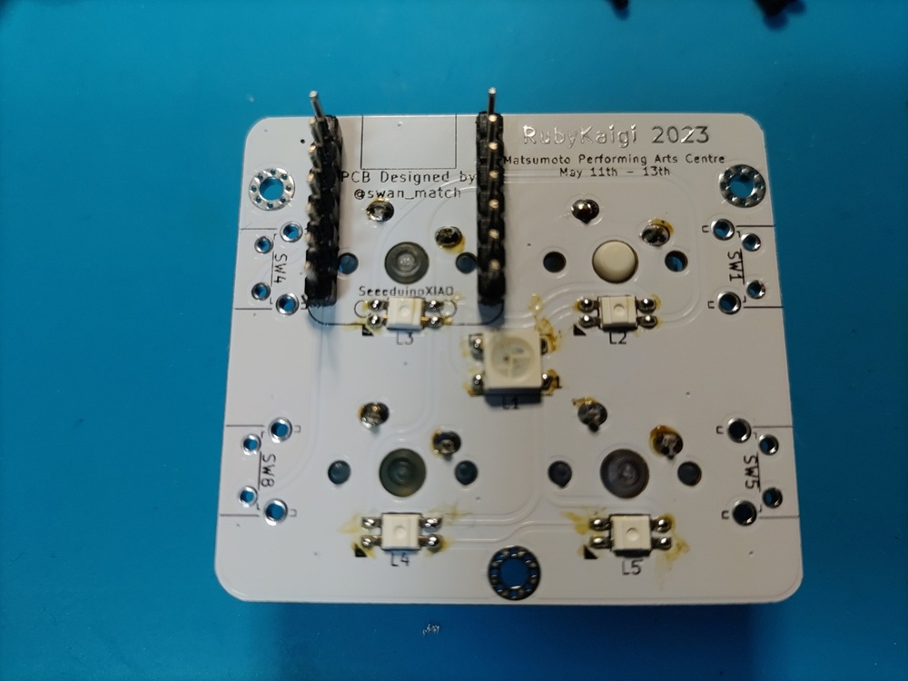
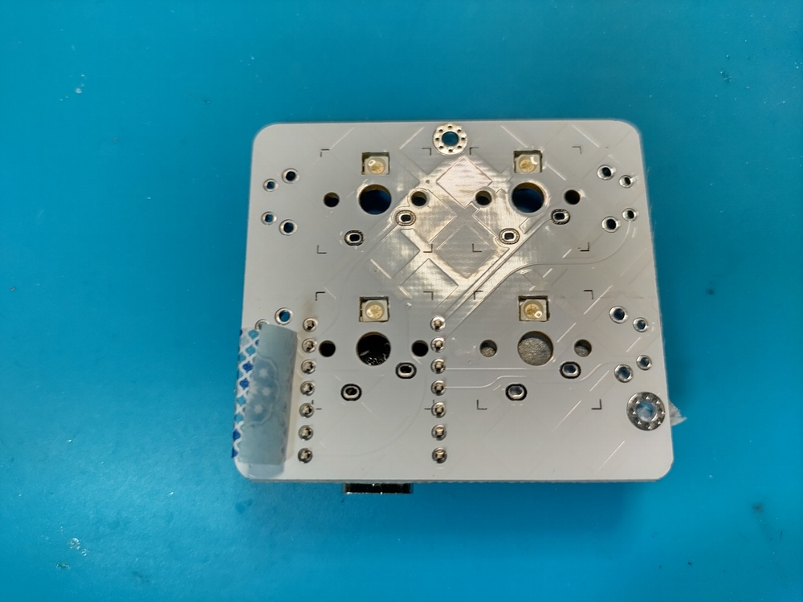
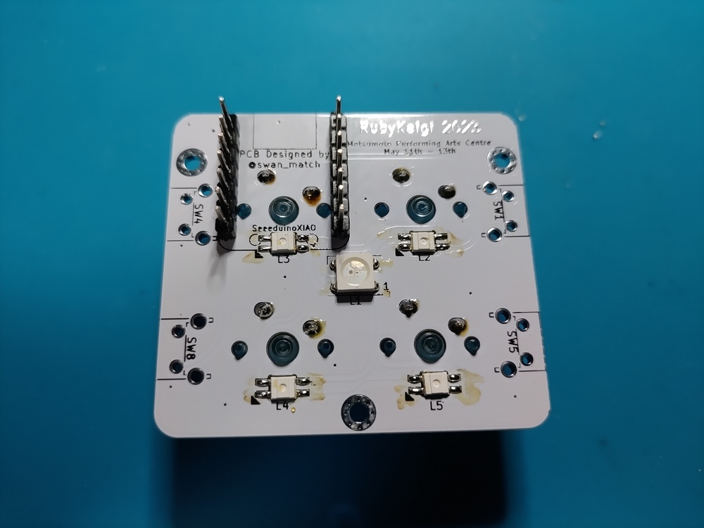
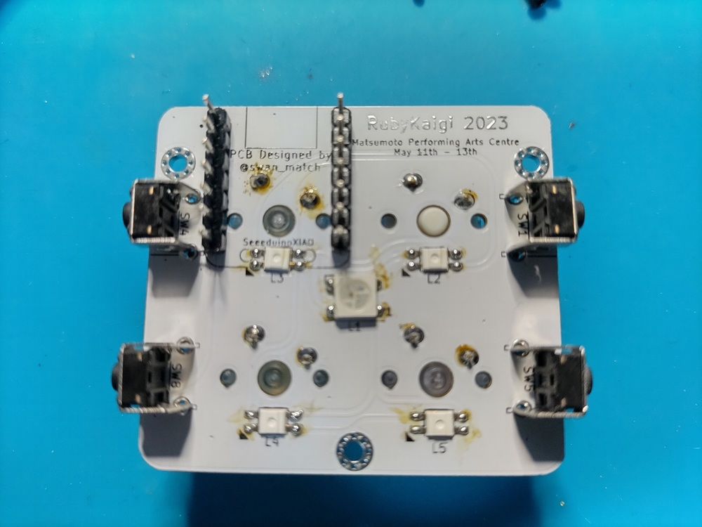
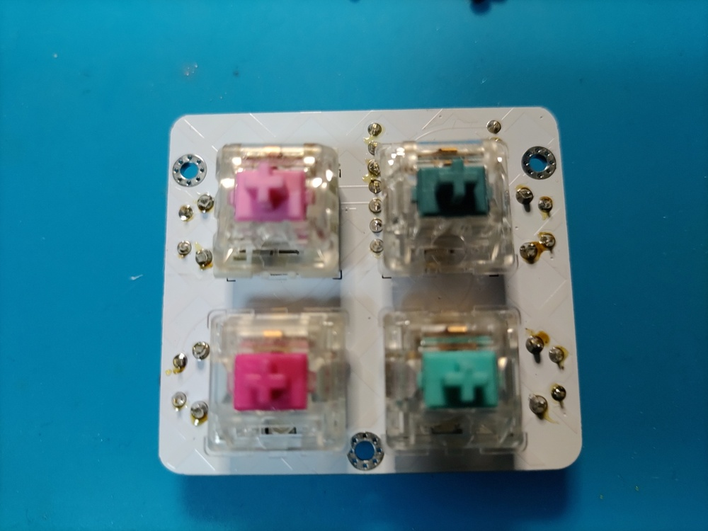
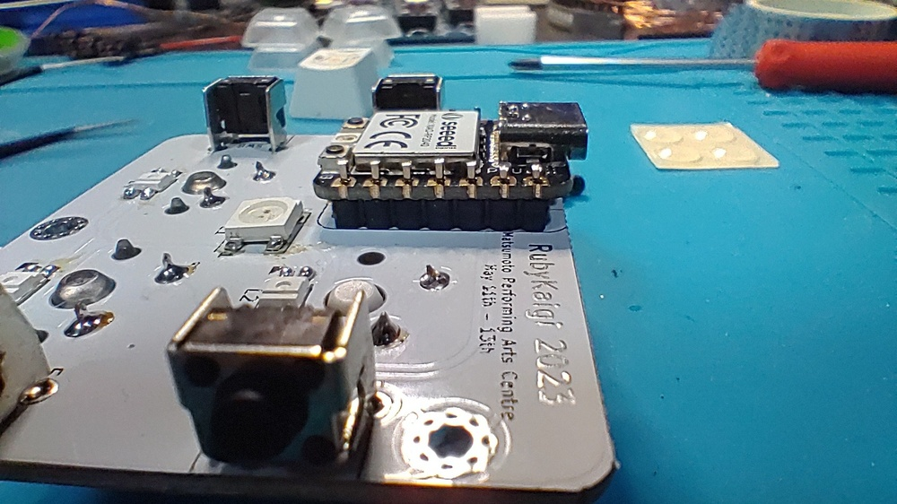
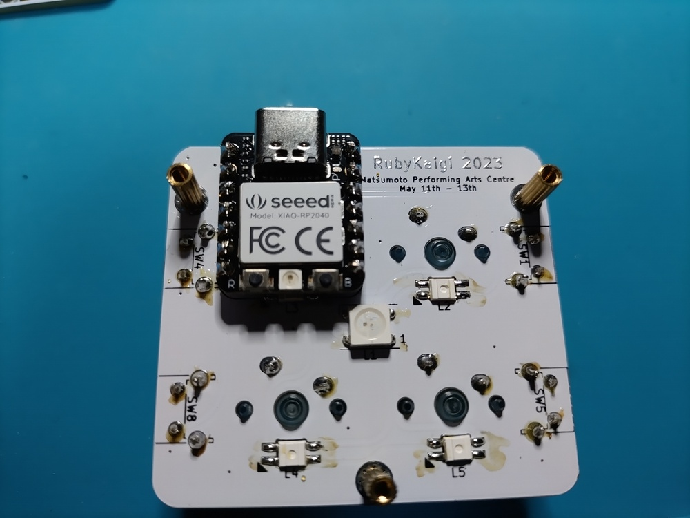
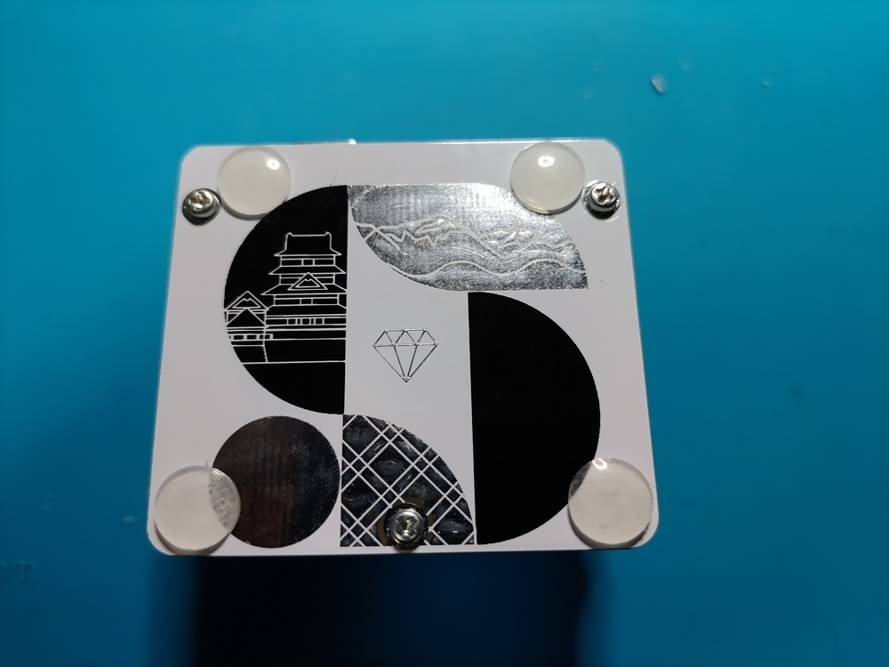

# RubyKaigi 2023 ノベルティキーボード ビルドガイド

**[English page is Here](./readme_en.md)**

## 概要

RubyKaigi 2023で配布するマイクロパッド。  
小さいながらもアングルドタクトスイッチを搭載することで合計8キーを搭載可能。  
とても小さくはんだ付け箇所も少ないので、初めての電子工作、ファームウェアにいいかもしれない。  
アンダーグローとバックライトを両方採用しているので、**とても良く光ります。**

## 部品

### 付属品

| 品目                    | 数量 |
| :---------------------- | ---: |
| PCB                     |  1枚 |
| ボトムプレート          |  1枚 |
| LED小(SK6812mini)       |  4個 |
| LED大(WS2812B)          |  1個 |
| M2L7丸スペーサ          |  3本 |
| M2L4ネジ                |  6本 |
| タクトスイッチ(大)      |  4個 |
| ゴム足                  |  4個 |

### 別途必要なもの

| 品目                     | 数量 | 入手先 |
| :----------------------- | ---: | :----- |
| XIAO RP2040              |  1個 | [talpkeyboard](https://talpkeyboard.net/items/63534f58f5197322fceb6487) [秋月電子](https://akizukidenshi.com/catalog/g/gM-17044/) |
| 7ピン ピンヘッダ(*1)     |  2本 | [遊舎工房](https://shop.yushakobo.jp/products/3696?_pos=2&_sid=62c590295&_ss=r&variant=42476836946151) [秋月電子](https://akizukidenshi.com/catalog/g/gC-00167/) |
| MX互換スイッチ(5pin推奨) |  4個 | [遊舎工房](https://shop.yushakobo.jp/collections/all-switches) [talpkeyboard](https://talpkeyboard.net/?category_id=59cf8860ed05e668db003f5d) |
| 1Uキーキャップ           |  4個 | [遊舎工房](https://shop.yushakobo.jp/collections/keycaps/products/dsa-blank-keycaps) [talpkeyboard](https://talpkeyboard.net/?category_id=59e2acfaed05e644fd004008) |
| USBケーブル(TYPE-C)      |  1本 | 100円ショップなど |

*1 ) XIAO RP2040は販売元によってピンヘッダが付属している場合もあるので注意してください。  
折って使えるタイプのものであれば14ピン以上のものを1つ購入して7ピンずつに折ればよいです。  
プロマイクロに付属しているピンヘッダが余っていればそれも使えます。

## 工具

| 品目               | 入手先 |
| :----------------- | :----- |
| 温度調整ハンダゴテ | [Amazon](https://www.amazon.co.jp/gp/product/B08L6KJBGP/ref=as_li_tl?ie=UTF8&camp=247&creative=1211&creativeASIN=B08L6KJBGP&linkCode=as2&tag=swanmatch06-22&linkId=902f31009670f3b7cd79891d00479e72)、ホームセンターなど |
| 低温はんだ         | 100円ショップなど |
| ピンセット         | 100円ショップなど |
| マスキングテープ   | 100円ショップなど |
| ニッパー           | 100円ショップなど |
| テスター (トラブル時に必要) | [Amazon](https://www.amazon.co.jp/gp/product/B07GJ891VR/ref=as_li_tl?ie=UTF8&camp=247&creative=1211&creativeASIN=B07GJ891VR&linkCode=as2&tag=swanmatch06-22&linkId=bd42afeb7ff9ca4a61af44a62215c148)、ホームセンターなど |

## 組み立て手順

### ファームウェア

実装を始める前に、まずはRP2040マイコンが正常に機能しているか確認してください。

1. XIAO RP2040のBootボタン(向かって右側のボタン)を押しながらUSBケーブルでPCと接続して、`RPI-RP2`というボリュームのファイルシステムとしてマウントされることを確認してください。
2. [PRK Firmware](https://github.com/picoruby/prk_firmware/releases)から.u2fファイルをダウンロードします。(特にこだわりなければ最新の安定版)
3. マウントされたRP2040のファイルシステムにu2fファイルをドラッグ&ドロップします。
4. `PRK_FIRMWARE`として再マウントされるので、[keymap.rb](./keymap.rb)をダウンロードしてドラッグ&ドロップしてください。

この手順がうまく行かない場合RP2040の初期不良である可能性が高いです。  
運が悪かったと諦めてもう一つ購入してください...

### SK6812MINI

LED(小)をはんだ付けします。  
三角のシルクマークが付いているパッドがLEDの欠けているタブに対応しています。  

LEDは比較的熱に弱いので、温度調整はんだごてで240℃くらいで、手早くはんだ付けしてください。

### WS2812B

LED(大)をはんだ付けします。

左上(┌)がLEDのかけている角に対応しています。

まず一箇所のパッドにハンダを盛ります。

次にそのパッドを温めながらピンセットでLEDをパッドの上に乗せて、位置が決まったらコテを離してハンダを冷やして固めます。(難しいところ)

残りのパッドにハンダを流し込みます。

### ピンヘッダ

**このあたりから手順を間違えると結構リカバリが面倒なので注意し作業を行ってください。**

ピンヘッダを基板に差し込みます。

RP2040を差し込みます。**(RP2040のはんだ付けはまだしないこと！)**

マスキングテープで仮止めします。  
(仮止めできればなんでもいいのですが、セロハンテープは熱で溶けそうなのであまりよくないと思います。)

ある程度きちんと固定しておかないと、ピンヘッダが基板に対して垂直にならず、
最悪あとでRP2040がはまらない悲しいことになります。

反対側にひっくり返します。

ピンヘッダの四隅をはんだ付けします。

すべてのピンをはんだ付けしてしまうとリカバリが困難なので、
この段階でピンヘッダが基板から浮いたりしていないかよく確認しておくといいです。

問題なければすべてのピンをはんだ付けしてください。

### スイッチ

基板をひっくり返してスイッチをはめ込みます。

5pinは位置がブレるのを防ぐためにあえて固めにしているので、強く置くまで押し込んでください。

3pinタイプのスイッチの場合はスイッチが微妙に傾いてしまって、キーキャップが干渉してしまうことがあるのであんまりオススメしないです。  

再度裏面にひっくり返して、スイッチをはんだ付けします。  

### タクトスイッチ

タクトスイッチを裏面から差し込みます。

反対側(表、スイッチ側)に戻してはんだ付けします。

タクトスイッチのピンが表面にあるので、余分な分はニッパーで切っておくといいです。

はんだ付け面が表に来るのが気になる方はタクトスイッチを表面に実装しても回路的には問題ありませんが、
取り付けるスイッチやキーキャップによってはキーキャップがタクトスイッチに干渉してしまう場合があります。

### RP2040

部品実装面が上になるようにRP2040を乗せます。  

ピンヘッダがちょっと長いのでニッパーで切り落とします。  
↓が長さの目安です。

はんだ付けします。

### ボトムプレート、ゴム足

回路基板とボトムプレートをスペーサーでネジ止めして、ボトムプレートの四隅にゴム足を貼り付けます。  
(完成が近づくにつれて早る気持ちを抑えきれずに写真撮り忘れます)

## 完成

